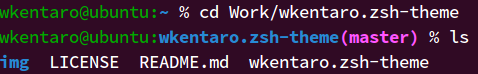
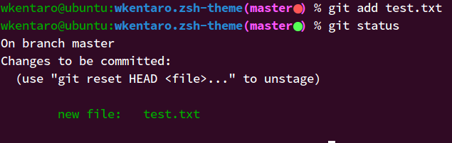
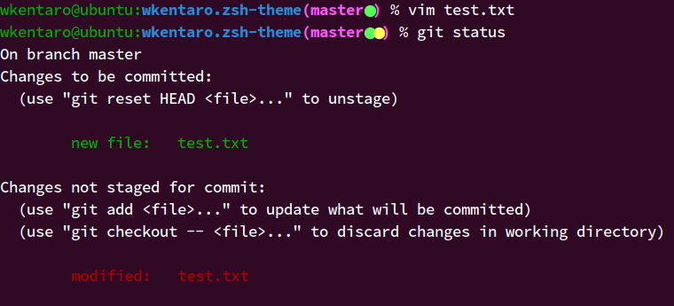

# zsh-theme
Simple zshell theme for git user.

Installation
------------
```zsh
% git clone https://github.com/wkentaro/zsh-theme.git ~/.zsh-theme
% echo "source ~/.zsh-theme/theme.zsh" >> .zshrc
```

Normal
------


Untracked Files (Red)
--------------------


Staged Changes (Green)
----------------------


Unstaged Changes (Yellow)
-------------------------


License
-------
[MIT](LICENSE)

