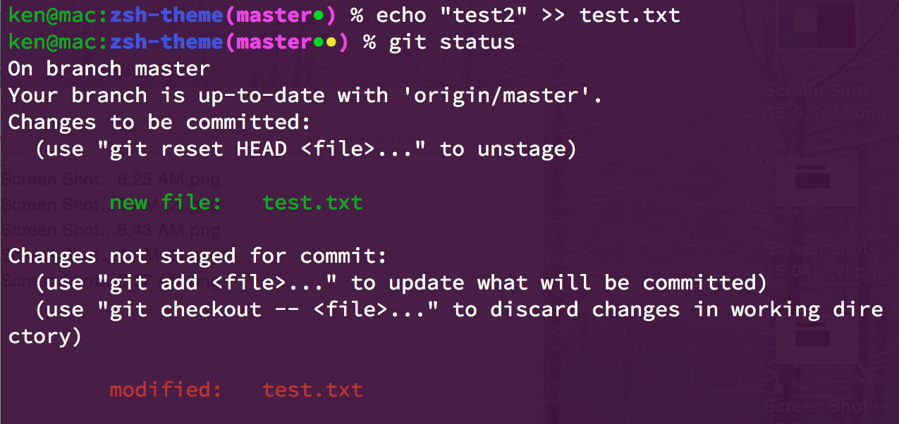

=========
zsh-theme
=========

.. image:: https://travis-ci.org/wkentaro/zsh-theme.svg
  :alt: Build Status
  :target: https://travis-ci.org/wkentaro/zsh-theme

.. image:: https://badge.fury.io/gh/wkentaro%2Fzsh-theme.svg
  :target: http://badge.fury.io/gh/wkentaro%2Fzsh-theme

.. image:: https://img.shields.io/badge/license-MIT-blue.svg
  :alt: MIT License
  :target: https://github.com/wkentaro/zsh-theme/blob/master/LICENSE

Simple zshell theme for git user.

Installation
============

.. code-block:: zsh

  % git clone https://github.com/wkentaro/zsh-theme.git ~/.zsh-theme
  % echo "source ~/.zsh-theme/theme.zsh" >> .zshrc

Samples
=======

Normal
------
.. image:: img/normal.png

Untracked Files (Red)
--------------------
.. image:: img/untracked_files.png

Staged Changes (Green)
----------------------
.. image:: img/staged_changes.png

Not staged Changes (Yellow)
-------------------------

License
=======
Copyright (C) 2015 Kentaro Wada
Released under the MIT license
https://github.com/wkentaro/zsh-theme/blob/master/LICENSE

